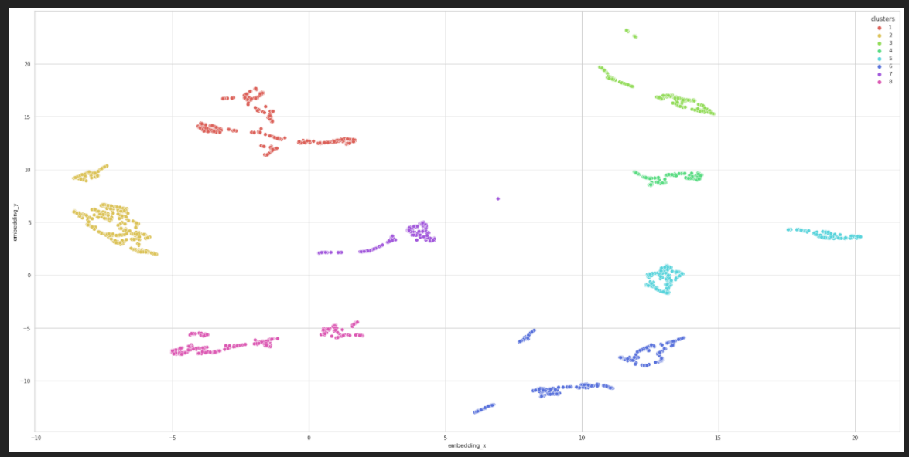
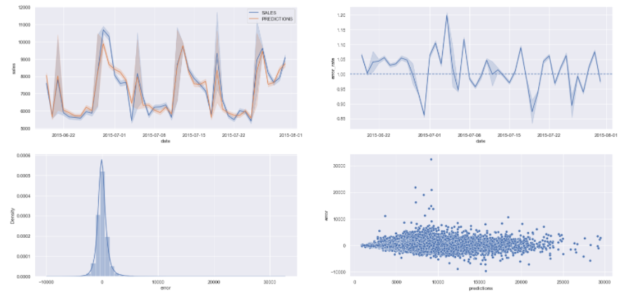
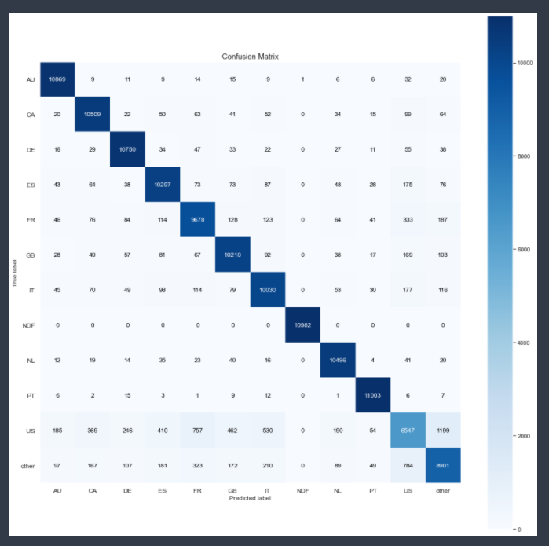

### Hi there 👋

# Lucas Ezequiel 
*Junior Data Scientist*

I´m a civil engineer switching to Data Science and I´ve been studying Machine Learning since 2019. I am focused in achieving mastery in the development of solutions to business problems, using Data Science tools and going from the stage of understanding the business context to deploying Machine Learning models and creating new business insights.

During this time, I have developed solutions for business problems such as identifying customers in churn, prioritizing customers for cross-selling, reducing CAC values, predicting a store sales and creating an EDA from data scraped from an advertisement website.

The details of each solution are described in the projects below.

### **Analytical Tools:**

**Data Collect and Storage:** web scraping, SQL, MySQL.

**Data Processing and Analysis:** Python, Spark.

**Development:** Linux, Git. 

**Data Vizualization:** Power BI.

**Machine Learning Modeling:** Classification, Regression, Clustering, Time Series. 

**Machine Learning Deployment:** Flask, Heroku.  

**Links:**
* 
* 

## Data Science Projects:

# [Insiders Clustering](https://github.com/LucasBMedeiros/insiders_clustering)

## Business Problem

A UK-based online retail store has captured the sales data for different products for the period of one year (Nov 2016 to Dec 2017). The organization sells gifts primarily on the online platform. The customers who make a purchase consume directly for themselves. There are small businesses that buy in bulk and sell to other customers through the retail outlet channel. The company needs to find significant customers for the business who make high purchases of their favourite products, with the intent of rolling out a loyalty program to the high-value customers after identification of segments. Use the clustering methodology to segment customers into groups.

:--:
<b>Nine Hierarchical Clusters over UMAP Space for Customer Segmentation</b>

### [Sales Prediction](https://github.com/LucasEzBM/rossmann-sales)

Rossmann operates over 3,000 drug stores in 7 European countries. Currently, Rossmann store managers are tasked with predicting their daily sales for up to six weeks in advance. Store sales are influenced by many factors, including promotions, competition, school and state holidays, seasonality, and locality. With thousands of individual managers predicting sales based on their unique circumstances, the accuracy of results can be quite varied.

:--:
<b>Sales Prediction over time with XGBoost</b>

### [User´s First Booking](https://github.com/LucasEzBM/airbnb_users_first_booking) 

In this multilabel imbalanced classification problem, Airbnb needs to predict the which country a new user's first booking destination will be. There are 12 possible outcomes of the destination country: 'US', 'FR', 'CA', 'GB', 'ES', 'IT', 'PT', 'NL','DE', 'AU', 'NDF' (no destination found), and 'other'. At each crisp cycle the model gets less biased towards the 'USA' outcome, and increases its balanced accuracy.

:--:
<b>Confusion Matrix performance of Random Forest on Balanced Dataset</b>

### [Churn Prediciton](https://github.com/LucasEzBM/churn_prediction) 

In saturated markets, the cost to retain a customer is much less than prospecting for new customers. Machine Learning models are able to predict whether or not the customer will renew their service contract with the company in the next year. This information about the users is very important to optimize efforts in prioritizing customers who should continue with the contract in the company.
In this context, I developed a Machine Learning algorithm to identify whether or not a customer will stop using the banking service. The performance of the model in identifying the customer who will enter in churn period is 90%, which represents an additional U$ 20 million in revenue.

## Data Anaysis - Insight Projets

### [Web Scraping for EDA from rent prices at OLX](https://github.com/LucasEzBM/scraper_rent_prices)

Often, when looking to rent a place, advertising websites can be quite dispendious to scroll around. Looking to have a view of the big picture of prices for houses and apartments in a city, I developed this scraper that goes through OLX´s data, cleans it up and provides a basic EDA of house prices.

<!--
**LucasEzBM/LucasEzBM** is a ✨ _special_ ✨ repository because its `README.md` (this file) appears on your GitHub profile.
